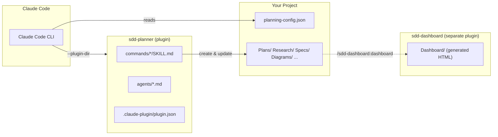
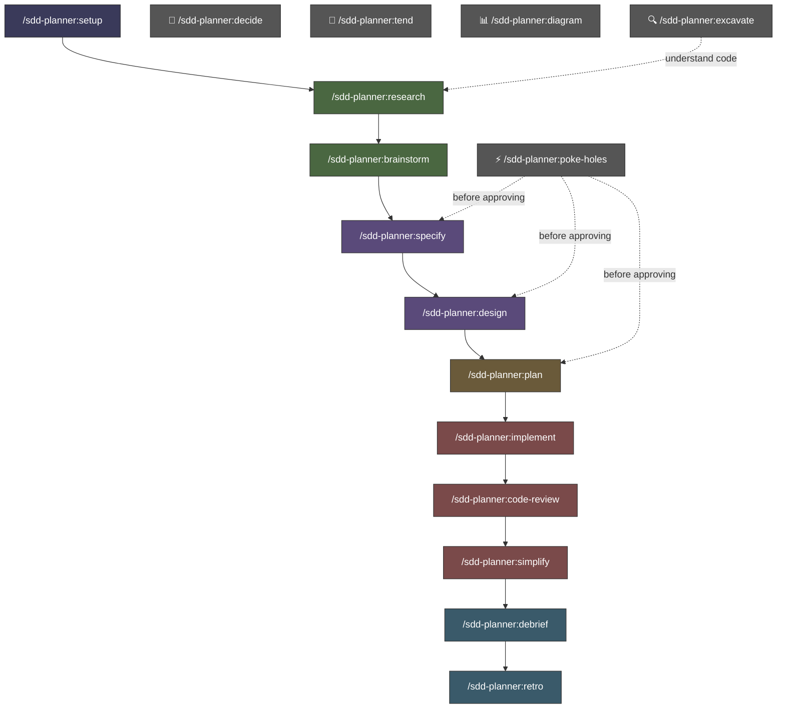
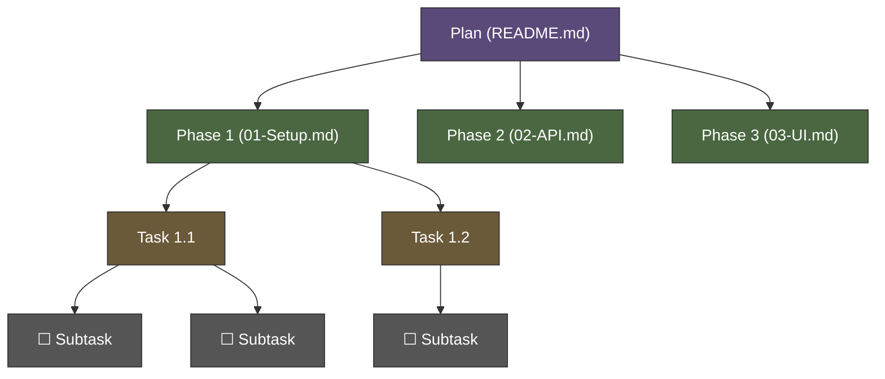
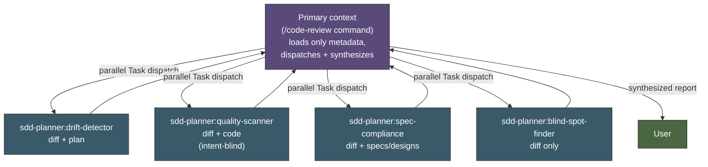

# SDD Planner

A [Claude Code](https://docs.anthropic.com/en/docs/claude-code) plugin for spec-driven development — structured project planning end-to-end. It provides slash commands that guide you through a full planning lifecycle — from research to retrospective — with YAML-frontmatter-driven artifacts.

For the optional HTML dashboard view of these artifacts, install the companion [`sdd-dashboard`](https://github.com/danweinerdev/sdd-dashboard-plugin) plugin.

## How It Works

SDD Planner is a standalone Claude Code **plugin**. When loaded (via `--plugin-dir` or through a marketplace), it registers 16 slash commands (namespaced under `/sdd-planner:*`) and 8 review/implementation agents that Claude can delegate to. All artifacts are Markdown files with YAML frontmatter — companion tools (like `sdd-dashboard`) read frontmatter exclusively, so there's no brittle table parsing.



## Quick Start

### From any repo

```bash
# From the repo where you want planning artifacts to live
claude --plugin-dir /path/to/sdd-planner

# Then inside Claude:
> /sdd-planner:setup
# Generates planning-config.json, bootstraps directories
```

`/sdd-planner:setup` lays out planning artifacts wherever you want them — at the repo root (planningRoot of `"."`), under a subdirectory (e.g. `"Planning"`), or in an entirely separate directory pointed at by an absolute path. See [Where Planning Artifacts Live](#where-planning-artifacts-live) below for the trade-offs.

### Use with git worktrees

Run `/sdd-planner:setup` in each worktree. Setup auto-detects worktrees and inherits `planningRoot` from siblings:

```bash
# In the first worktree — provide the planning root explicitly
claude --plugin-dir /path/to/sdd-planner
> /sdd-planner:setup /path/to/worktree --planning-root /path/to/planning-repo

# In subsequent worktrees — settings are inherited automatically
> /sdd-planner:setup /path/to/another-worktree
```

Each worktree gets its own `planning-config.json` and `claude.sh` launcher.

## Slash Commands

All commands are namespaced as `/sdd-planner:*` automatically by the plugin system.

### Lifecycle Commands

| Command | Purpose | Output |
|---------|---------|--------|
| `/sdd-planner:setup` | Set up a repo for planner | `planning-config.json`, `claude.sh`, directories |
| `/sdd-planner:research` | Investigate a topic | `Research/<topic>.md` |
| `/sdd-planner:brainstorm` | Explore possibilities | `Brainstorm/<topic>.md` |
| `/sdd-planner:specify` | Write requirements | `Specs/<feature>/README.md` |
| `/sdd-planner:design` | Technical architecture | `Designs/<component>/README.md` |
| `/sdd-planner:plan` | Create or expand an implementation plan (gap-analysis-driven on re-run) | `Plans/<Name>/README.md` + phase docs |
| `/sdd-planner:implement` | Execute a plan phase | Code + updated task/phase statuses |
| `/sdd-planner:code-review` | Review code — orchestrated drift + quality + spec + blind-spot review | Unified report (synthesis + raw sub-reports) |
| `/sdd-planner:simplify` | Post-implementation cleanup | Simplified code, tests verified |
| `/sdd-planner:debrief` | After-action notes | `Plans/<Name>/notes/<phase>.md` |
| `/sdd-planner:retro` | Capture learnings | `Retro/YYYY-MM-DD-<slug>.md` |

### Utility Commands

| Command | Purpose | Output |
|---------|---------|--------|
| `/sdd-planner:poke-holes` | Adversarial critical analysis | Inline findings (no artifact) |
| `/sdd-planner:decide` | Record, look up, or reconcile decided truths in the decision ledger | `Decisions/decisions.md` entries |
| `/sdd-planner:tend` | Artifact hygiene (incl. decision-ledger audit) | Updates stale statuses, tags, conventions |
| `/sdd-planner:diagram` | Generate Mermaid diagrams | `Diagrams/<subject>.md` or inline |
| `/sdd-planner:excavate` | Progressive codebase discovery | `Research/<codebase>.md` |

For the HTML dashboard and quick text status, install the companion [`sdd-dashboard`](https://github.com/danweinerdev/sdd-dashboard-plugin) plugin. It adds `/sdd-dashboard:dashboard` and `/sdd-dashboard:status`.

## Workflow Lifecycle

Commands follow a natural planning progression. You don't have to use every step — jump in wherever makes sense. Utility commands can be used at any point.



| Phase | Commands | What happens |
|-------|----------|-------------|
| **Setup** | `setup` | Configure a repo for planner |
| **Discovery** | `research`, `brainstorm`, `excavate` | Gather context, explore options, map codebases |
| **Definition** | `specify`, `design` | Lock down requirements and architecture |
| **Execution** | `plan` | Structure work into phases, tasks, subtasks (re-run to deepen an existing plan) |
| **Implementation** | `implement`, `code-review`, `simplify` | Build it, verify it, then clean it up |
| **Review** | `debrief`, `retro` | Capture what happened and what you learned |
| **Utilities** | `poke-holes`, `decide`, `tend`, `diagram`, `excavate` | Challenge, record truth, maintain, visualize, explore |

## Plan Hierarchy

Plans follow a four-level hierarchy, similar to Jira's project structure:



| Level | Stored in | Status values |
|-------|-----------|---------------|
| **Plan** | `Plans/<Name>/README.md` frontmatter | `draft` `approved` `active` `complete` `archived` |
| **Phase** | `Plans/<Name>/01-Phase.md` frontmatter | `planned` `in-progress` `complete` `blocked` `deferred` |
| **Task** | Phase frontmatter `tasks:` array | `planned` `in-progress` `complete` `blocked` `deferred` |
| **Subtask** | Phase body as `- [ ]` checklists | Checkbox state |

## Agents

The plugin includes review agents that Claude can delegate to:

| Agent | Model | Purpose |
|-------|-------|---------|
| `researcher` | Sonnet | Gathers context from artifacts, codebase, and web |
| `plan-reviewer` | Sonnet | Reviews plans for completeness, feasibility, and conventions |
| `spec-reviewer` | Haiku | Reviews specs for testability, completeness, and ambiguity |
| `code-implementer` | Opus | Implements code from plan tasks in the target codebase |
| `drift-detector` | Sonnet | Diff + plan only — missing work, scope creep, approach drift |
| `quality-scanner` | Sonnet | Diff + code only (intent-blind) — correctness, safety, maintainability, over-engineering |
| `spec-compliance` | Sonnet | Diff + specs/designs only — requirements coverage, contract violations |
| `blind-spot-finder` | Sonnet | Diff only — adversarial fresh-eyes reviewer |

### Code Review Architecture

`/code-review` dispatches the four specialized reviewers **from the primary context** (the slash command itself), because Claude Code does not allow subagents to spawn other subagents. The orchestration is inside the slash command, not an intermediate orchestrator agent.



- **Primary context (`/code-review`)** identifies the plan/phase/repo/diff-scope references, reads only the plan's `related` frontmatter to find spec/design paths, and resolves a concrete `git diff` range. It does **not** read plan bodies, spec bodies, design bodies, or full diff contents.
- **Four specialized reviewers** run in parallel in their own fresh contexts. Each sees only the inputs for its lane. `blind-spot-finder` in particular sees only the diff — no plan, no specs, no designs — because its adversarial value depends on that isolation.
- **`drift-detector`, `quality-scanner`, and `blind-spot-finder`** validate every finding against the full file and calling context, not just the diff hunk, because diffs lie by omission.
- **Primary context** then synthesizes the four reports — highlighting confirmed findings (caught by 2+ reviewers), disagreements between reviewers (often the most valuable signal), and blind spots only `blind-spot-finder` caught — and presents the unified review to the user.

**Hard contract:** `/code-review` must dispatch the four sub-agents via Task. It must not do the review in primary and present it as a four-lane result. If any dispatch fails, the command returns a loud error and stops — there is no fallback to self-synthesis.

#### Bring your own review lanes

The four built-in lanes are a floor, not a ceiling. Any project can plug in its **own** specialized reviewers — a SQL-migration reviewer, a Terraform reviewer, an accessibility reviewer — without forking the plugin. Drop a **read-only** agent file at `.claude/agents/<name>-reviewer.md` (in the repo whose code you review, or `~/.claude/agents/` for a personal one), with one required field in its frontmatter:

```yaml
---
name: sql-reviewer
description: "Reviews SQL migrations for lock contention and irreversible DDL."
tools: [Read, Grep, Glob, Bash]   # keep it read-only — lanes must not write to the repo
reviewLane: true          # the only required field — marks this as a review lane
appliesTo: ["**/*.sql", "**/migrations/**"]   # optional: only run when these paths change
lane: code                # optional: code | spec | plan | diff-only for plugin-enforced isolation
required: false           # optional: true = a non-run forces the verdict to BLOCKED
---
```

`/code-review` globs for `*-reviewer.md` lanes, matches each against the diff's shape, and dispatches the matches as **additional** parallel lanes alongside the built-in four. The plugin grows a socket; your project brings the plug. The guarantees that make this safe:

- **Additive only.** Project lanes only *add* findings; they never replace or weaken a built-in lane's inputs or dispatch.
- **Best-effort, never fatal.** A lane that's missing, broken, or errors out is reported and dropped — the four built-ins always run. A review with zero working project lanes is exactly the review you get today. (The socket imposes no timeout, so keeping a lane responsive is your responsibility — a hung lane holds up the review.)
- **Never silent.** A declared lane that doesn't run **degrades the verdict headline**, and a `required` lane that doesn't run **blocks** it — so a green check can't hide an un-run lane.
- **Read-only and trust-gated.** Lanes must be read-only, and `/code-review` confirms discovered lanes before dispatching when the target repo isn't your own session's project (they execute repo-supplied instructions with your tool access).

The full convention — `appliesTo`/`lane` semantics, the input bundle each `lane` receives, the `required` gate, and the failure taxonomy — is in `shared/review-lanes.md`, with a copy-and-fill template at `shared/templates/custom-reviewer.md`.

`/implement` dispatches `quality-scanner` directly after each task for a fast intent-blind quality check. `/simplify` dispatches it in `simplify` mode for complexity analysis. Both bypass the full four-lane review because the question they're asking is local to the code at hand.

### MCP Server Inheritance

The plugin aims to be **generic** — it should work with whatever MCP servers your project has configured without hard-coding server names. It achieves this by splitting agents into two groups:

| Group | Agents | Behavior |
|---|---|---|
| **Inherit session tools** (no `tools:` frontmatter) | `researcher`, `code-implementer`, `quality-scanner`, `plan-reviewer`, `spec-reviewer` | Automatically pick up any MCP servers available in the session — `context7`, Linear, Notion, Slack, whatever. They use these for library docs, ticket lookups, and API verification. Guardrails in each agent's body keep the read-only ones (`researcher`, `quality-scanner`, `plan-reviewer`, `spec-reviewer`) from making write-shaped calls even though they technically could. |
| **Restricted allowlist** (`tools:` frontmatter) | `drift-detector`, `spec-compliance`, `blind-spot-finder` | Tight allowlist of built-in tools only. No MCP access. These three depend on intent isolation — `blind-spot-finder`'s value is that it's given only the diff; adding MCPs would let intent leak in through tickets or external docs. |

If you want stricter guarantees on the inheriting agents (e.g., preventing `code-implementer` from touching your ticketing MCP), drop an override into your project's `.claude/agents/<name>.md` — project-local agents take precedence over plugin-provided ones and can declare an explicit `tools:` list of your choosing.

Recommended MCP servers to install for the best experience:
- **context7** — current library docs. `researcher`, `code-implementer`, `quality-scanner`, `plan-reviewer`, and `spec-reviewer` all benefit immediately.
- Any project-relevant knowledge-base MCP (Linear, Notion, Confluence, Jira) — `researcher` uses them during planning; `plan-reviewer` and `spec-reviewer` use them to cross-check artifacts against the linked source-of-truth tickets.

## Where Planning Artifacts Live

`planningRoot` in `planning-config.json` is just a path. It can be relative or absolute — the plugin doesn't care. Pick whichever suits your repo layout:

| `planningRoot` value | Effect |
|---|---|
| `"."` (or omitted) | Artifacts live at the repository root. Useful when the repo's whole purpose is planning. |
| `"Planning"` (relative) | Artifacts live in a subdirectory of the current repo. Useful when planning lives next to code. |
| `"/home/user/Code/my-planning-repo"` (absolute) | Artifacts live in an external directory, often shared by multiple code repos. |

`/sdd-planner:setup` defaults `planningRoot` to `"."` — the target repo root — and re-running it preserves the `planningRoot` of an existing config rather than overwriting it.

Plans can reference code in other repos via `repositories` and `planMapping`:

```json
{
  "planningRoot": ".",
  "repositories": {
    "my-app": { "github": "org/my-app" }
  },
  "planMapping": {
    "MyPlan": { "repo": "my-app" }
  },
  "planRepository": "my-app"
}
```

Absolute filesystem paths to those code repos go in `planning-config.local.json` (gitignored):

```json
{ "repositories": { "my-app": { "path": "/home/user/Code/my-app" } } }
```

## Dashboard

The HTML dashboard previously bundled with this plugin has moved to a companion plugin, [`sdd-dashboard`](https://github.com/danweinerdev/sdd-dashboard-plugin). Install it alongside `sdd-planner` to get:

- `/sdd-dashboard:dashboard` — regenerate the static HTML dashboard from artifact frontmatter
- `/sdd-dashboard:status` — quick text-only status summary (read-only)

The dashboard is opt-in via `"dashboard": true` in `planning-config.json` (plus optional `title` / `description` for the page chrome). If you don't install the companion plugin, those fields are simply ignored.

## Directory Structure

```
sdd-planner/                       # The plugin itself (not your project)
├── .claude-plugin/
│   └── plugin.json               # Plugin manifest (name: "sdd-planner")
├── commands/                     # Slash commands → /sdd-planner:* (each command is its own dir with SKILL.md)
│   ├── brainstorm/SKILL.md
│   ├── code-review/SKILL.md
│   ├── debrief/SKILL.md
│   ├── decide/SKILL.md
│   ├── design/SKILL.md
│   ├── diagram/SKILL.md
│   ├── excavate/SKILL.md
│   ├── implement/SKILL.md
│   ├── plan/SKILL.md
│   ├── poke-holes/SKILL.md
│   ├── research/SKILL.md
│   ├── retro/SKILL.md
│   ├── setup/SKILL.md
│   ├── simplify/SKILL.md
│   ├── specify/SKILL.md
│   └── tend/SKILL.md
├── skills/                       # Model-only reference skills (auto-loaded by description, not /-invocable)
│   ├── cpp-specifications/SKILL.md
│   ├── decision-log/SKILL.md
│   ├── go-specifications/SKILL.md
│   ├── java-specifications/SKILL.md
│   ├── python-specifications/SKILL.md
│   ├── rust-specifications/SKILL.md
│   ├── swift-specifications/SKILL.md
│   └── typescript-specifications/SKILL.md
├── agents/                       # Review agents
│   ├── blind-spot-finder.md
│   ├── code-implementer.md
│   ├── drift-detector.md
│   ├── plan-reviewer.md
│   ├── quality-scanner.md
│   ├── researcher.md
│   ├── spec-compliance.md
│   └── spec-reviewer.md
├── hooks/
│   ├── hooks.json                # Plugin hooks — SessionStart decision-ledger injection
│   └── load-decisions.sh         # Emits accepted ledger entries as additionalContext
├── shared/
│   ├── frontmatter-schema.md     # Artifact metadata schema (single source of truth)
│   ├── path-resolution.md        # Canonical planning-root / plugin-dir / target-repo resolution
│   ├── vcs-detection.md          # VCS detection algorithm + operations table (git / p4 / plain)
│   ├── orchestration.md          # Orchestration model, session onboarding, post-compaction re-reads
│   ├── autonomy.md               # Cross-skill autonomy table — what runs solo vs stops for the user
│   ├── decision-log.md           # Decision ledger — entry schema, capture triggers, collision procedure
│   ├── review-lanes.md           # Project-supplied review-lane socket convention
│   ├── language-verification.md  # Language-specific verification — what good looks like
│   ├── languages/                # Per-language verification references
│   └── templates/                # Document templates (plan, spec, design, diagram, ...)
├── Makefile                      # make bump-patch / bump-minor / bump-major
├── bump-version.py               # Version-bump helper used by the Makefile
├── LICENSE
├── CLAUDE.md                     # Claude Code project instructions
└── README.md
```

## Requirements

- [Claude Code](https://docs.anthropic.com/en/docs/claude-code) CLI
- Python 3 only if you also use the companion `sdd-dashboard` plugin
